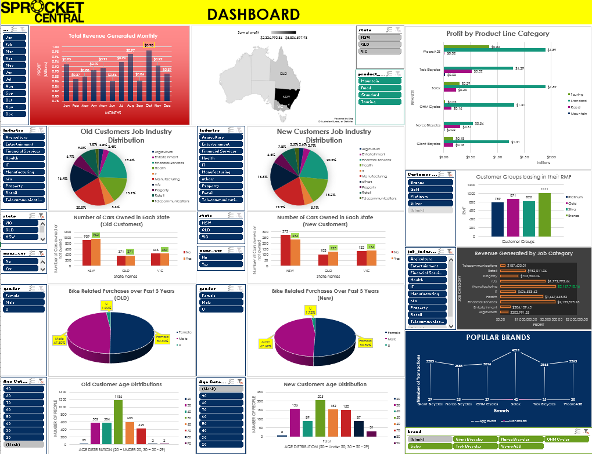

# KPMG-Virtual-Internship

## This repository is a development of Data Analytics Consulting Virtual Internship by KPMG (through Forage)

### Main focused on
- Data Quality Assessment
- Data Insights
- Presentation

## Task: To identify the top customers who can add more value to the company profits

### Data Quality Assessment
**Assessment of Data Quality and Completeness in preparation for analysis**

Need to Check:

> (- Accuracy      - Correct Values
- Completeness	- Data fields with Values (Should not be empty)
- Consistency 	- Values free from contradiction
- Currency 	    - Values up to Date
- Relevancy 	  - Data Items with values (meta-data) 
- Validity	    - Data containing allowable values
- Uniqueness	  - Records that are duplicated)
  
### Data Insights
**Targeting high value customers based on Customer Demographic, Transactions and Customer Attributes**

It also includes modelling to achieve the desired outcome of the specified task.

### Presentation
**Using visualisations to present insights**
Generated Top 1000 Customers to be focused using RFM model.

  
 
  
